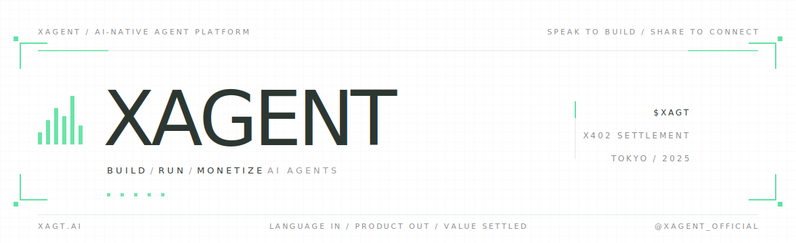
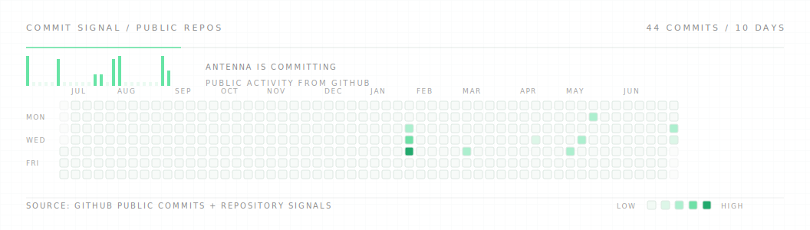

  

  <a href="https://xagt.ai"><b>xagt.ai</b></a>
  &nbsp;/&nbsp;
  <a href="https://docs.xagt.ai">docs</a>
  &nbsp;/&nbsp;
  <a href="https://x.com/XAgent_official">@XAgent_official</a>

  

  <b>Speak an agent into shape. Ship it as a product.</b> 
  XAgent turns natural-language product intent into agents that run, connect to tools, publish to a marketplace, and settle usage on-chain.

 

## What We Are Building

XAgent is an AI-native agent platform for turning intent into usable software. The builder describes the agent; the runtime gives it memory, tools, and execution; the marketplace makes it discoverable; settlement lets usage become a product loop.

  <b>BUILD</b> 
  Natural-language product intent becomes an agent people can actually use.

  <b>RUN</b> 
  Agents operate with context, tools, wallets, and hosted execution.

  <b>DISTRIBUTE</b> 
  Published agents become discoverable, shareable, and reusable.

  <b>SETTLE</b> 
  Usage and monetization are designed around x402 from the start.

## Product Surface

**XAgent** is the product layer: create, run, publish, and monetize agents.

**Xerness** is the orchestration layer: turn requirements into runnable multi-agent systems.

**Xpense** is the payment layer: budgets, approvals, usage, and settlement.

**XAGT Plugin** extends the wallet and marketplace surface for agent-native commerce.

**Agent Marketplace** is the distribution layer for first-party and community agent skills.

## Activity

  

## Find Us

**Website** [xagt.ai](https://xagt.ai) &nbsp;/&nbsp; **Docs** [docs.xagt.ai](https://docs.xagt.ai) &nbsp;/&nbsp; **X** [@XAgent_official](https://x.com/XAgent_official)

Building from Tokyo since 2025. Private commit history can be made available to partners and auditors under NDA.
